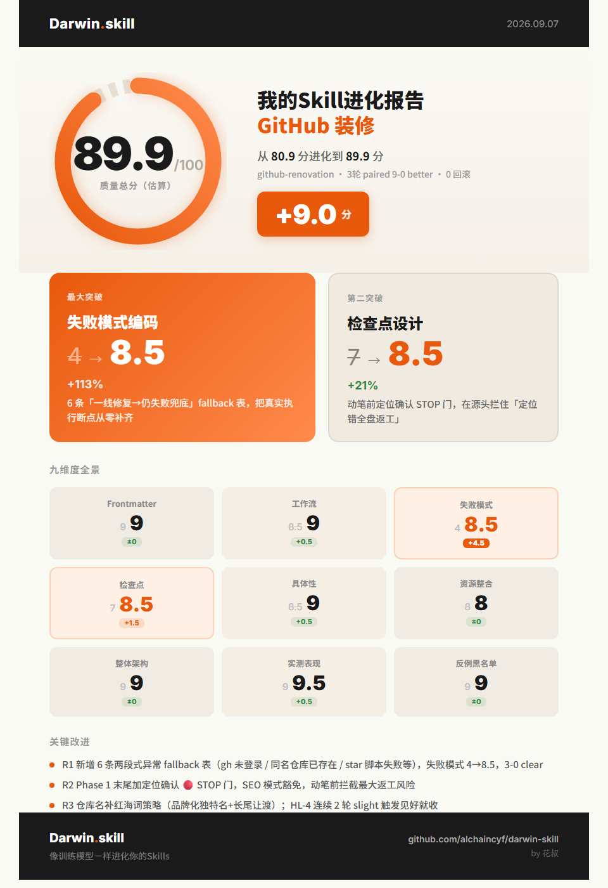

<div align="center">

# GitHub-Renovation · GitHub 装修

**把 GitHub 仓库的门面当产品来打磨：README 是第一说服面，profile 主页是个人"官网"，SEO 让机器和用户都愿意点进来**

项目 README · profile 主页仓库 · 仓库元数据 SEO —— 三条产线可单独做，也可全套装修

[](#-四种装修模式)
[](#-安装)
[](#-核心原则)
[](LICENSE)

</div>

---

> 📦 本系统是 [Huanyu-Skills 合集](../)的一员——可独立使用，也可与其他 skill 互相配合。

GitHub-Renovation 是一个**仓库门面装修系统**：为开源项目编写能说服人的 README、搭建个人"官网"式 profile 主页、做仓库 SEO 体检。收到请求先判定是哪条产线（README / 主页 / SEO），再按 Phase 流程走——先定位、后装修、写入前必须让你确认。它不是模板填空机：所有描述从仓库真实内容提炼，数字可验证，没有营销虚词。

## 👀 效果预览

本 skill 自身经达尔文 skill 2.0 自动优化验证：**三轮配对盲评 9:0 胜出，质量预估分 80.9 → 89.9**。

<div align="center">



</div>

## 🧭 四种装修模式

| 你说 | 模式 | 产出 |
|---|---|---|
| "写 README" / "优化这个 README" | **A · 项目 README** | 按 14 节信息架构取舍成文（居中头部 / 关键词前置首段 / 核心特性 / 快速开始 / FAQ / License…），附 description 与 topics 建议 |
| "装修 GitHub 主页" / "做 profile README" | **B · 主页仓库** | `用户名/用户名` 建仓方案 + 中英双语互链主页 + star 数自动刷新 workflow + bio/Pin 自查清单 |
| "项目和主页都要" | **A + B 全套** | 上面两条全做，内链结构打通（主页链仓库、仓库链回主页） |
| "仓库搜不到" / "帮我做 GitHub SEO" | **C · SEO 体检** | 用 `gh` 查 description / topics / bio 现状，按四杠杆诊断，给出可直接执行的修复命令 |

## 🧱 核心原则

1. **先定位，后装修** —— 主页讲一条故事线（我是谁 → 我在做什么 → 代表作），README 讲一条价值线（解决什么 → 怎么用 → 凭什么信）。定位一句话你确认前，不动笔。
2. **减法优先于加法** —— 0-star 不放星数和 stats 卡片（负资产）；不放 fork 仓库；不链 private 仓库（访客 404 = 死链）。
3. **诚实可验证** —— 所有描述从仓库真实 README 提炼，数字可验证，没有营销虚词。
4. **SEO 靠元数据不靠玄学** —— 四个杠杆按权重排：仓库 description（= Google 结果标题）＞ README 首两行（= 摘要片段）＞ topics（= 站内标签流量）＞ bio（= 主页 meta description）。
5. **🔴 写入 GitHub 前必须确认** —— 所有文件先在本地落盘给你过目；`gh repo edit` 等改线上元数据的命令，先展示后执行。

## 🔁 工作流

```text
Phase 1  信息收集    能自己查的不问（gh 查现状）；必问的一次问全；定位一句话经你确认
   ↓
Phase 2A  项目 README   按 14 节骨架按需取舍（数据合规类 / 有画廊演示站的加读对应范本）
Phase 2B  主页仓库      建仓 → 双语互链 → 漏斗结构 → star 自动刷新脚本 → profile 元数据清单
   ↓
Phase 3  SEO 优化    仓库元数据（description / topics / bio / Pin）+ 内容 SEO + 诚实边界告知
   ↓
Phase 4  交付验收    README / 主页两份 checklist 逐项过，提醒几天后自查收录
```

## 📁 目录结构

```text
GitHub-Renovation/
├── SKILL.md                  ← Agent 读的入口说明书（唯一必需文件）
├── README.md                 ← 本文件
├── LICENSE                   ← MIT
├── references/
│   ├── profile-要素.md        ← 主页设计要素单一来源（做主页时 Agent 必读）
│   ├── update-stars.py       ← star 数自动刷新脚本（复制进主页仓库，改 OWNER 即用）
│   └── update-stars.yml      ← 对应的 GitHub Actions workflow（手动触发）
├── template/
│   ├── readme参考/           ← 3 份 README 范本：功能型 / 数据合规型 / 媒体视觉型
│   └── 装修技巧.md           ← SEO 技巧全景 + 真实装修复盘
├── test-prompts.json         ← 四种模式的触发测试用例
└── darwin-result-card.png    ← 质量优化评分卡（见上方效果预览）
```

## 📦 安装

零依赖，复制即用：

```bash
git clone https://github.com/Huanyu-Hibiki/Huanyu-Skills.git

# 复制进你的 Agent skills 目录，例如：
cp -r Huanyu-Skills/GitHub-Renovation ~/.claude/skills/GitHub-Renovation
# OpenCode: ~/.opencode/skills/  ·  Codex: ~/.codex/skills/
```

可选增强：装了 [GitHub CLI](https://cli.github.com/)（`gh`）并登录后，Agent 能自动查你仓库的线上现状、直接更新 description / topics / bio；没装也能用——自动降级为网页手动操作清单。

## 🚀 第一次使用

在你的 Agent 里直接说人话：

```text
帮我的开源项目写一个完整的 README
```

Agent 会先问你几个定位问题（一次问全），确认定位一句话后再动笔，成品先落盘给你过目。

## 💬 日常用法

```text
给我的项目写个 README：<仓库地址或本地目录>       → 模式 A
装修我的 GitHub 主页，用户名是 <username>        → 模式 B
全套装修：<仓库地址> + 主页                      → A + B
我的仓库搜不到，做个 SEO 体检：<仓库地址>         → 模式 C
```

## ✅ 适合 / ❌ 不适合

**✅ 适合**：想让项目 README 从"能看"变"能说服"的开发者；想搭 profile 主页把 GitHub 变成个人官网的人；仓库搜不到、想做 GitHub SEO 的维护者；0-star 起步不想放负资产的新人。

**❌ 不适合**：对象不是 GitHub 仓库门面的任务——"装修房子"、"写文章/周报"、"优化这段代码"都会被拒绝；"帮我刷 star / 买粉"明确拒绝（违反 GitHub 条款）。

## ❓ FAQ

**GitHub 项目 README 怎么写才专业？**
用模式 A：按 14 节信息架构按需取舍，首段放定位句（是什么 + 给谁用 + 解决什么）而不是欢迎语，首两行埋搜索关键词，再配 description 和 topics 建议。

**GitHub 个人主页上那个自我介绍 README 是怎么弄的？**
创建一个与你用户名完全同名的公开仓库，在根目录放 `README.md`，GitHub 会自动渲染到个人主页 Overview——这是唯一官方途径。模式 B 会把建仓、双语互链、star 自动刷新一次配齐。

**为什么我的仓库在 Google 搜不到？**
按权重查四个杠杆：仓库 description（= 搜索结果标题）→ README 首两行 → topics → bio。模式 C 用 `gh` 逐项体检并给出修复命令；注意 GitHub 出站链接都是 nofollow，收录需要几天到几周。

**不会编程能用吗？**
能。零依赖，把文件夹复制进 Agent 的 skills 目录即用；`gh` 只是可选增强，没装会自动降级为网页手动操作清单。

**它会背着我直接改 GitHub 上的东西吗？**
不会。所有 README / 主页文件先在本地落盘给你过目；`gh repo edit` 这类改线上元数据的命令先展示、你确认后才执行。

## 🧯 异常与兜底

`gh` 未登录 → 降级为网页手动清单；主页仓库已存在 → 在现有 README 基础上迭代不覆盖；star 脚本无变化 → 先查 OWNER / FILES / 标记三件事；推送到主页不渲染 → 核对仓库名与用户名完全一致、public、README.md 在根目录。完整对照表见 [SKILL.md](SKILL.md) 的「异常与 fallback」一节。

## 📄 License

MIT。商用、改造、二次分发都行，详见 [LICENSE](LICENSE)。

---

## 👤 关于作者 · 呼风唤雨的焕羽

我是**呼风唤雨的焕羽**，**工程合规 AI 创业者**——工程管理专业出身，从央企经营部走出来，现在经营一人公司（OPC），用 AI Agent 重做工程本行（合同审查 / 招投标合规 / 资质管理），全过程 [Build in Public](https://github.com/Huanyu-Hibiki)。本 skill 的完整手把手教程与实战演示，都在我的视频里：

| 平台 | 账号 |
|---|---|
| 小红书 | 呼风唤雨的焕羽 |
| B站 | 呼风唤雨的焕羽 |
| 视频号 | 呼风唤雨的焕羽 |
| 抖音 | 呼风唤雨的焕羽 |

<div align="center">

🔍 **四个平台全同名，搜索「呼风唤雨的焕羽」看视频教程**


<sub>微信扫一扫 / 搜一搜「**呼风唤雨的焕羽**」关注公众号，第一时间获取 skill 更新与 AI 实战干货</sub>

</div>
