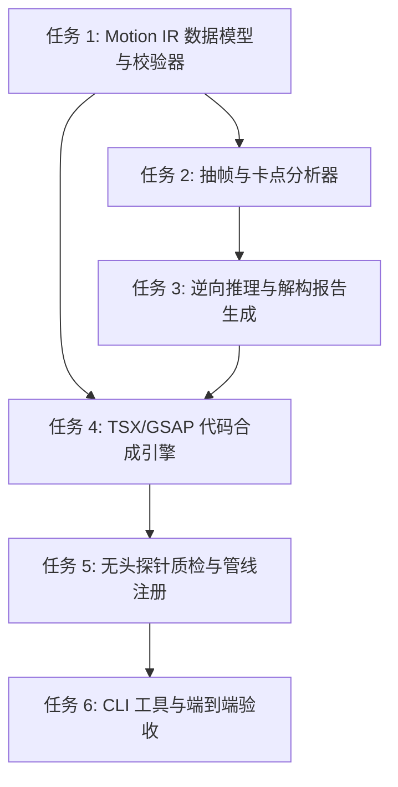

# 爆款视频动效解构分析与参数化模板生成实施计划

## 总览

依据已批准的《爆款视频动效解构分析与参数化模板生成设计文档》（含 Grill-me 4 大决策），构建端到端闭环的动效逆向工程与参数化生成工具链。采用 Tracer-bullet 垂直切片方法，从中间表达（Motion IR Schema）出发，贯通 FFmpeg 时序网格抽帧与短时能量卡点分析，编排多模态 Agent 输出解构报告，合成参数化 Remotion/GSAP 代码，并通过 1 秒无头试渲染探针硬闸门后安全注册至生产管线。

用户已完成 Grill-me 压力测试，确认输入边界为短切片/区间优先、Agent 协作式视觉模型契约、沙箱化递增版本隔离，以及真实试渲染出厂质检。

---

## 前置准备

- [x] 设计文档已获用户批准并完成 Grill-me 决策回填（`docs/designs/2026-09-17-motion-analysis-and-synthesis-design.md`）。
- [x] 确认开发环境就绪（Python 3.13 / UV，Node v22，FFmpeg 已就绪）。
- [ ] 运行现有全量测试套件确认基线通过（101 个测试已确认基线稳定通过）。

---

## 统一实施约束与合规红线

1. **合法合规与自主实现**：参考项目仅作为设计思想输入（如 Visual IR、图层拆解、物理缓动），严格按照自主 Python+UV+Remotion 技术栈干净实现，严禁生搬受限许可证代码。
2. **零污染与沙箱隔离**：自动合成的代码统一写入 `video-production-workflow/templates/synthesized/<style_pack>/<template_id>.tsx`，强制使用 `remotion-viral-` 命名空间前缀；若 ID 冲突自动递增版本号（如 `-v2`），严禁就地修改手写生产文件。
3. **真实证据先于声明（硬闸门）**：模板生成后必须自动执行 **1 秒（30 帧）真实无头试渲染探针**，核验无语法/类型报错且画面有实际运动像素（非黑屏/非空），验证通过才标记 `approved` 并注册至 `broll_registry`，失败则沉淀错误日志并标记 `draft_failed`。
4. **确定性与优雅降级**：若视频无音轨，自动平滑回退至纯视觉关键帧相位分析，不中断主干流程；模型解析失败支持自愈重试。

---

## 任务列表 (Tracer-Bullet 垂直切片)

### 任务 1: Motion IR 核心数据模型与契约校验器
- **交付**: 确立系统单一契约源。支持加载、验证与序列化包含元数据、视觉语言、音画锚点（BPM/Onsets）、多图层生命周期（进场/驻留/退场五相位及 spring 物理缓动）、引擎偏好（Remotion/GSAP）的 Motion IR，非法格式或时序错乱即时拦截。
- **验收标准**:
  - [x] 实现 `MotionIR`、`LayerPhase`、`AudioAnchors`、`VisualLanguage` 等完整 Pydantic / 数据类结构。
  - [x] 支持 JSON Schema 互转与严格类型断言（如非法的缓动参数、超出总时长的关键帧时间戳被正确捕获）。
  - [x] 编写独立单元测试，覆盖合法样本反序列化、缺损字段默认值填充及异常值断言。
- **阻塞边**: 无（可立即开始）。
- **安全**: 否。两阶段审查通过（Spec Review: PASS, Quality Review: PASS）。

---

### 任务 2: 多媒体时序抽帧与短时能量卡点分析器
- **交付**: 给定 2~8 秒视频（或带 `--start`/`--end` 的长视频），通过 FFmpeg 抽取 5 个动作相位（0%, 20%, 50%, 80%, 100%）并拼接为横向接触网格图（`contact_sheet.png`，打有时序浮印）；同时提取音频并通过短时能量 RMS 差分算法计算客观卡点与重音（Onsets），无声视频平滑降级。
- **验收标准**:
  - [x] 封装 `media_extractor.py`，支持指定时间切片或全片抽取。
  - [x] FFmpeg 抽帧拼图管道健壮运行，输出符合分辨率与比例约束的时序网格图。
  - [x] 实现纯 Python/无重型依赖的音频提取与 RMS 能量峰值/Onset 卡点检测算法，输出毫秒级时间戳列表。
  - [x] 针对纯静音/无声视频样本测试，验证降级保护正常，不抛出崩溃异常。
  - [x] 编写测试覆盖有声与无声样本的抽取、网格图生成及卡点时间序列正确性。
- **阻塞边**: 任务 1。
- **安全**: 是（涉及外部媒体文件路径与 FFmpeg 命令行参数转义）。两阶段审查与安全审计全部通过（Spec Review: PASS, Quality & Security Audit: PASS）。

---

### 任务 3: 动效逆向推理与解构报告生成器
- **交付**: 编排结构化解构提示词，将提取的时序接触图与音频卡点注入上下文，驱动多模态视觉能力进行层级分离、运动轨迹与物理缓动拟合，生成结构化《爆款动效解构报告》（Markdown）并导出严格符合契约的 `motion_ir.json`。
- **验收标准**:
  - [x] 编排符合 `motion-decomposition-spec.md` 标准的多模态解构 Prompt。
  - [x] 实现 Agent 协作与离线环境变量（API Key）双重执行适配器。
  - [x] 输出物包含可读性强的 Markdown 报告与符合任务 1 Schema 的 `motion_ir.json`。
  - [x] 内置 JSON 格式自愈与重试机制，对模型格式瑕疵做防御性清洗。
  - [x] 编写测试模拟多模态响应解析，验证报告生成及与 Motion IR 契约的无缝绑定。
- **阻塞边**: 任务 1, 任务 2。
- **安全**: 否。两阶段审查通过（Spec Review: PASS, Quality Review: PASS，已加固凭证 Header 传输与 MIME 动态自适应）。两阶段审查通过（Spec Review: PASS, Quality Review: PASS）。

---

### 任务 4: 参数化 Remotion TSX / GSAP 代码合成引擎
- **交付**: 消费 `motion_ir.json`，自动合成符合规范的 React TSX 组件（或 GSAP 时间轴脚本）。自动将图层五相位与缓动映射为 Remotion 帧级 `spring()` / `interpolate()` 数学表达式，提取开放参数 Props（标题、数值、主题色等），写入沙箱隔离目录并自动维护版本。
- **验收标准**:
  - [x] 实现 `template_synthesizer.py`，支持 Remotion TSX 代码渲染。
  - [x] 准确将视觉层级和进退场相位转换为规范的 Remotion 绝对定位与弹性动画公式。
  - [x] 实施沙箱存储（`templates/synthesized/<style_pack>/`）与 `remotion-viral-` 前缀规范，实现同名版本自增递增（`-v2`）防覆盖逻辑。
  - [x] 编写单元测试验证生成的 TSX 语法合法性、Props 接口与版本自增隔离。
- **阻塞边**: 任务 1, 任务 3。
- **安全**: 是（涉及代码文件自动写入与路径防穿透）。

---

### 任务 5: 真实无头渲染探针质检闸门与管线注册
- **交付**: 模板合成后自动启动 **1 秒（30 帧）真实无头渲染探针**：校验编译与依赖有效性，并核验生成视频帧的像素运动（非黑屏/非空）。质检通过的模板打标为 `approved` 并注册至 `broll_registry.py`；失败模板打标 `draft_failed` 并持久化错误日志。
- **验收标准**:
  - [x] 实现无头探针执行器，针对新合成 TSX 运行 30 帧快速测试渲染。
  - [x] 实现有效像素运动检测（非全黑、非全透明），拦截空壳/崩溃模板。
  - [x] 实现 `broll_registry` 动态扩展机制，成功模板自动挂接至现有 B-roll 调度系统。
  - [x] 质检失败场景自动熔断、记录日志，不污染生产注册表。
  - [x] 编写单元测试模拟通过与失败场景，验证硬闸门判定与注册表状态一致性。
- **阻塞边**: 任务 4。
- **安全**: 是（子进程命令执行与依赖隔离）。

---

### 任务 6: 统一 CLI 工具集成与全链路端到端验收
- **交付**: 提供一致的命令行界面 `motion-analyzer/cli.py`（支持 `analyze` 与 `synthesize` 子命令），将输入、分析、报告、代码生成、渲染探针与管线挂接完整串接；完成端到端回归验收。
- **验收标准**:
  - [x] 命令行参数支持 `--input`、`--start`、`--end`、`--engine`、`--output-dir`。
  - [x] 提供端到端测试：从短视频样片输入，一键生成解构报告、TSX 组件、探针质检并注册到 B-roll 清单。
  - [x] 编写全流程自动化集成测试，确保回归测试全绿（101+ 个测试用例无破坏）。
  - [x] 更新工作流文档与技能文档（`SKILL.md`）。
- **阻塞边**: 任务 5。
- **安全**: 否。

---

## 并行机会 (Frontier)

- **初始 Frontier**: 任务 1（可立即启动）。
- 任务 1 完成后，任务 2 与任务 4 的 AST/模板骨架部分可并行解耦演进。

---

## 风险与缓解矩阵

| 风险点 | 概率 | 影响 | 缓解措施 |
| :--- | :--- | :--- | :--- |
| **外部参考项目许可证污染** | 低 | 高 | 明确只学习模式概念，所有代码使用原生 Python 与 Remotion 纯自主构建，不复制第三方专有代码。 |
| **无声视频导致卡点分析崩溃** | 中 | 中 | 音频提取增加纯声检测与静音降级机制，无音频时均匀按视觉相位切分。 |
| **LLM 幻觉生成无法运行的 TSX** | 中 | 高 | 引入任务 5 强制执行 1 秒真实无头渲染探针，像素与语法不过关绝不上线注册。 |
| **版本冲突覆盖已有生产模板** | 低 | 高 | 引入沙箱子目录与版本自增后缀（`-v1`, `-v2`），对现有目录只读。 |
